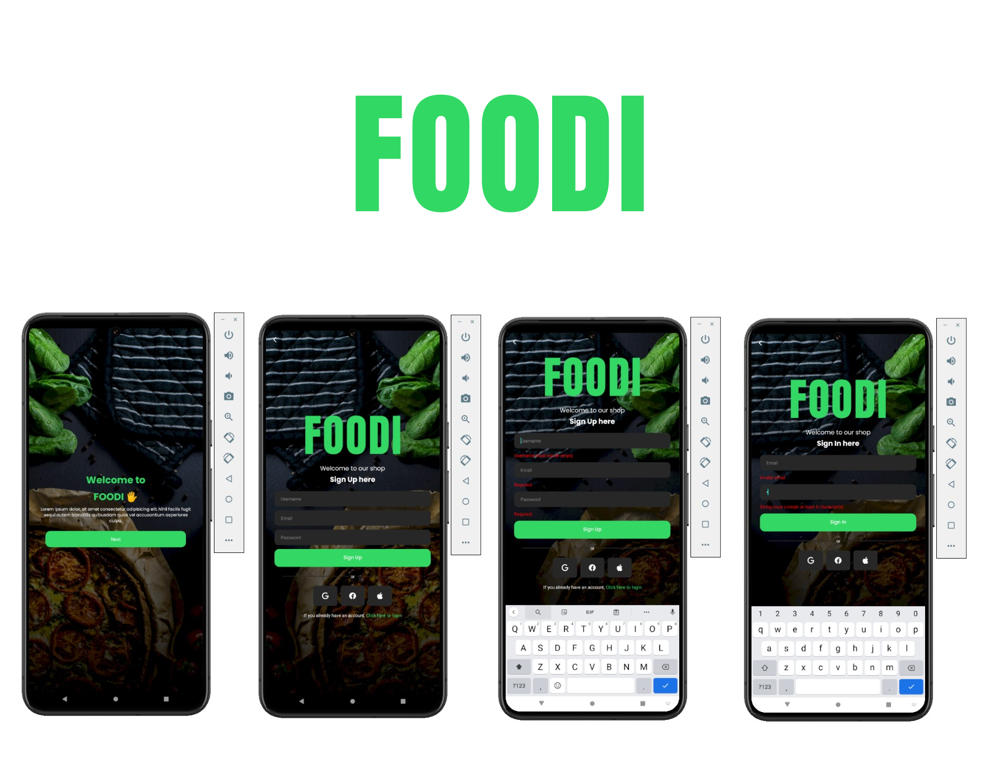
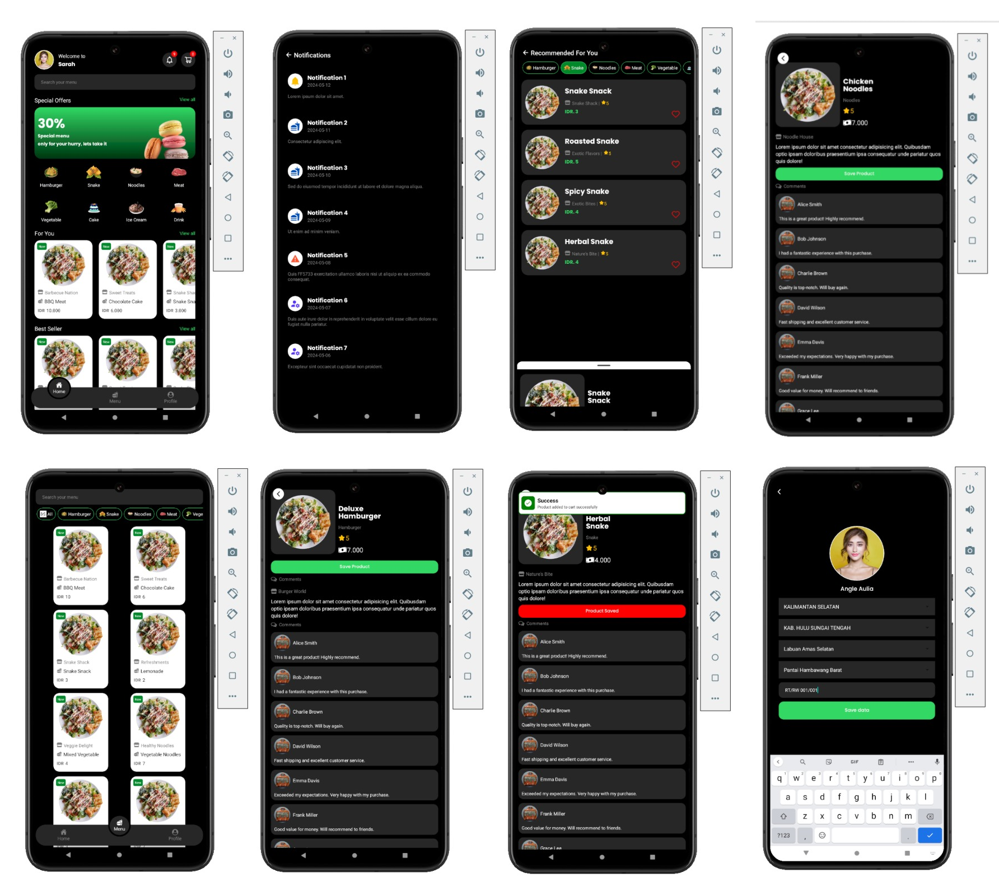
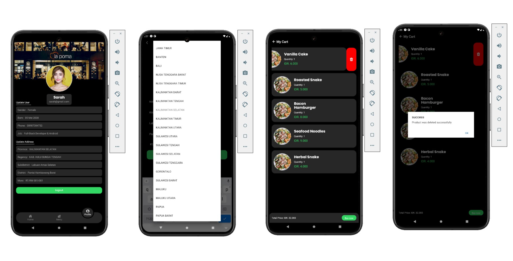

# FOODI online shop





## Overview

FOODI is a mobile application built using React Native. This app is designed to help users find their meals from several provided categories. With an intuitive interface and rich features, FOODI strives to be your best companion in the culinary world.

---

## Getting Started And Installation

To get started with the MyFashion Backend, follow these steps:

1. Clone the repository: git clone https://github.com/Juaini742/FOODI-react-nativee.git
2. Install dependencies:

```sh
cd frontend
```

```sh
npm install
```

```sh
cd backend
```

```sh
npm install
```

3. Run database migrations and seeders (backend):

```sh
npm run migrate
```

4. Run the server:

```sh
npm start
```

5. Run the client:

```sh
npm start
```

## Folder Structure Front-End (React Native)
front-end/
├── api/                   # Folder for fetching data
│   └── ...                # API files
├── app/                   # Main application folder
│   ├── (modals)/          # Collection of modals
│   ├── (tabs)/            # Collection of tabs
│   ├── address/           # Address form page
│   │   └── ...            # Address form components and files
│   ├── biodata/           # Biodata form page
│   │   └── ...            # Biodata form components and files
│   ├── categoryDetail/    # Category details page
│   │   └── ...            # Category details components and files
│   ├── greeting/          # Greeting page
│   │   └── ...            # Greeting page components and files
│   ├── login/             # Login page
│   │   └── ...            # Login page components and files
│   ├── productDetail/     # Product details page
│   │   └── ...            # Product details components and files
│   ├── register/          # Register page
│   │   └── ...            # Register page components and files
│   └── _layout.tsx        # Main layout file
├── assets/                # All assets of the application
│   └── ...                # Images, fonts, etc.
├── components/            # All reusable components
│   └── ...                # Component files
├── constants/             # Constants of the application
│   └── ...                # Constants files
├── hooks/                 # Custom hooks
│   └── ...                # Hook files
├── interfaces/            # All interfaces
│   └── ...                # Interface files
└── ...                    # Other root-level files (e.g., package.json, README.md)


## Folder Structure Back-End (ExpressJs)
backend/
├── prisma/                # Prisma ORM
│   ├── migrations/        # Migration files
│   ├── schema.prisma      # Prisma schema file
│   └── seed.ts            # Seed data for Prisma
├── src/                   # Source folder
│   ├── controller/        # All controllers
│   │   └── ...            # Controller files
│   ├── middleware/        # Middleware for routes
│   │   └── ...            # Middleware files
│   ├── router/            # All routes
│   │   └── ...            # Route files
│   ├── utilities/         # All custom functions
│   │   └── ...            # Utility files
│   ├── index.ts           # Main server file
│   └── seed.ts            # Seed data script
├── package.json           # Package file
├── tsconfig.json          # TypeScript configuration
└── ...                    # Other root-level files (e.g., README.md, .env)


### Table API Backend

#### Excel Data
We have compiled some data in an Excel table which can be accessed [here](https://docs.google.com/spreadsheets/d/1dGyefZwPJHKyTtsoDeUjpRdSFIVgBqiRkRYkyMSlSw8/edit?usp=sharing).

#### OR

| Model        | Controller        | Status | Method | HTTP                            |
| ------------ | ----------------- | ------ | ------ | ------------------------------- |
| User         | register          | done   | POST   | /api/public/user/register       |
|              | login             | done   | POST   | /api/public/user/login          |
|              | getOneUser        | done   | GET    | /api/secured/user/              |
|              | updateUser        | done   | PUT    | /api/secured/user/              |
|              |                   |        |        |                                 |
| Address      | addAddress        | done   | POST   | /api/secured/address            |
|              | updateAddress     | done   | PUT    | /api/secured/address/:id        |
|              | getAddressByUser  | done   | GET    | /api/secured/address            |
|              |                   |        |        |                                 |
| Product      | getProducts       | done   | GET    | /api/secured/product/?category= |
|              | getOneProduct     | done   | GET    | /api/secured/product/:id        |
|              |                   |        |        |                                 |
| Category     | getCategories     | done   | GET    | /api/public/category/           |
|              |                   |        |        |                                 |
| Cart         | getCartItemByUser |        | GET    | /api/secured/cart/              |
|              | addCartItem       | done   | POST   | /api/secured/cart/:id           |
|              | updateCartItem    | done   | PUT    | /api/secured/cart/:id           |
|              | deleteCartItem    | done   | DELETE | /api/secured/cart/:id           |
|              |                   |        |        |                                 |
| Notification | addNotification   |        | POST   |                                 |
|              | getNotification   |        | GET    |                                 |

If the router URL has “secured,” it requires authentication to access. If it has “public,” it means you can access that URL without authentication.

## Contributing

We welcome contributions from the community! If you find any issues or have suggestions for improvements, feel free to submit a pull request or open an issue.

## License

This project is licensed under the MIT License. Feel free to use, modify, and distribute the code as per the terms of the license.

## Contact

If you have any questions or feedback, please contact us at juaini742@gmail.com.

---
